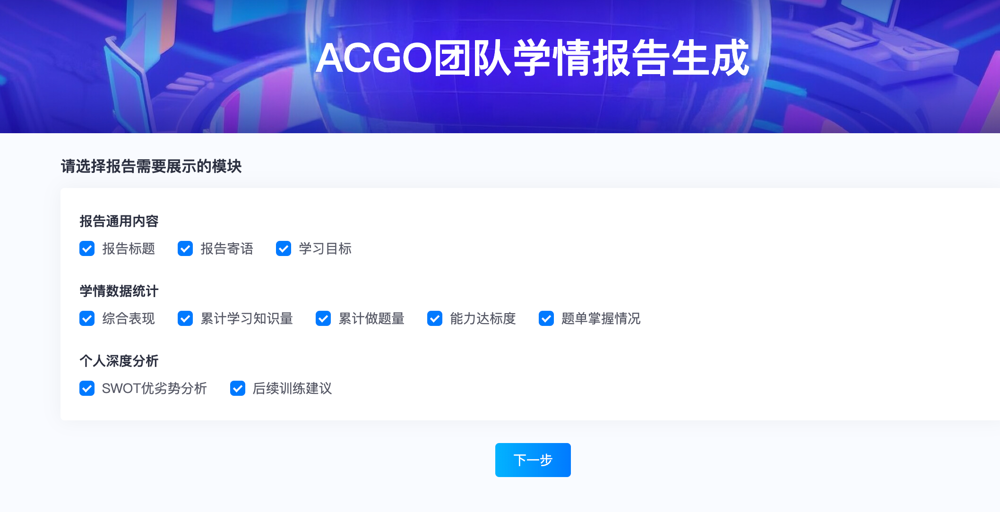

## 网址：https://www.acgo.cn/learningReport

## 第一步：

## 第二步：

### 报告标题：小码王信奥XP05集训营综合反馈表

### 报告标语：

### 学习目标：

​	DAY1

​	【今日课程内容】

​	（1）掌握：CSP-S复赛题型结构与常见考点。

​	（2）了解：S组一等奖得分情况、历年考频大数据与备考目标。

​	（3）通过2025 T1《社团招新》和2022 T2《策略游戏》，感受真题难度与不同题型的解题思路。

​	【今日测试重点】

​	（1）模板题基础掌握情况。

​	（2）综合算法能力摸底。

​	（3）当前知识漏洞定位。

​	DAY2

​	【今日课程内容】

​	（1）掌握：动态规划状态设计与状态转移。

​	（2）掌握：动态规划状态优化与转移优化。

​	（3）通过背包问题理解从暴力穷举到DP建模的完整过程，并学习存储差值类题目和数据结构优化DP决策的方法。

​	【今日测试重点】

​	（1）DP模板题。

​	（2）动态规划状态设计与转移推导。

​	（3）动态规划综合应用与代码实现能力。

​	DAY3

​	【今日课程内容】

​	（1）CSP-S复赛真题选讲：从暴力做法出发。

​	（2）讲解2021 T1《廊桥分配》，学习如何减少重复模拟。

​	（3）讲解2025 T2《道路修复》，训练从枚举方案逐步优化的思路。

​	（4）选讲2022 T1《假期计划》，体会枚举四个景点后的优化方法。

​	【今日测试重点】

​	（1）暴力枚举与优化思维。

​	（2）真题部分分分析。

​	（3）算法综合测试、补题与错题复盘。

​	DAY4

​	【今日课程内容】

​	（1）CSP-S复赛真题选讲：从特殊性质出发。

​	（2）讲解2024 T2《超速检测》，学习利用题目特殊性质设计做法。

​	（3）讲解2021 T3《回文》，训练通过观察关键性质推出解法。

​	（4）选讲2020 T3《函数调用》，从特殊情况逐步过渡到完整问题。

​	【今日测试重点】

​	（1）特殊性质分析。

​	（2）部分分条件利用。

​	（3）数据范围与解法匹配。

​	（4）算法综合测试、补题与总结。

​	DAY5

​	【今日课程内容】

​	（1）掌握：博弈问题基础分析方法。

​	（2）掌握：Nim、Bash等经典博弈模型。

​	（3）理解必胜态、必败态的判断与推导，并结合贪吃蛇相关题目训练复赛压轴题分析思路。

​	【今日测试重点】

​	（1）博弈模型识别。

​	（2）状态分析与结论推导。

​	（3）CSP-S模拟测试与综合算法运用能力。

​	DAY6

​	【今日课程内容】

​	（1）S组复赛模拟训练（二）。

​	（2）集中补题，修正前期测试与真题训练中暴露的问题。

​	（3）整理错题思路，补全关键代码实现，并通过讲解复盘常见失分点。

​	【今日测试重点】

​	（1）前期薄弱知识点巩固。

​	（2）错题订正与补题完成度。

​	（3）综合算法测试、代码实现稳定性与赛场时间分配。

​	DAY7

​	【今日课程内容】

​	（1）S组复赛模拟训练（三）。

​	（2）继续进行错题整理与补题训练。

​	（3）复盘前期测试中的思路漏洞与实现问题，强化CSP-S复赛综合解题能力。

​	【今日测试重点】

​	（1）错题复盘能力。

​	（2）算法综合应用。

​	（3）代码调试与实现细节。

​	（4）复赛模拟节奏适应。

​	DAY8

​	【今日课程内容】

​	（1）全天集中补题。

​	（2）整理前期遗留题目。

​	（3）针对未掌握的模板、真题和测试题进行二次巩固。

​	【今日测试重点】

​	（1）补题完成度。

​	（2）模板掌握情况。

​	（3）真题思路复盘。

​	（4）知识体系查漏补缺。

​	DAY9

​	【今日课程内容】

​	（1）S组复赛模拟训练（四）。

​	（2）完成最后阶段错题整理与重点题目复盘。

​	（3）通过模拟测试检验整体复习效果，并结合讲解明确后续冲刺阶段的刷题方向。

​	【今日测试重点】

​	（1）最终模拟训练。

​	（2）综合算法能力检验。

​	（3）重点题型复盘。

​	（4）代码实现与调试能力。

### 团队编号：2042058713337094144

### 用户id：学生acgo账号id

### 训练目标： CSP-S

### 竞赛id：19100,19101,19102,19103,19104,19105,19106,19107

### 题单id：43121,43122,43123,43125

### 填完这些内容后，点击计算学情

### 学习周期：学生实际上课的日期

### 累计做题量：以平台统计为准

### 累计学习知识量：以平台统计为准

### CSP-S能力达标度：以平台统计为准(C类学生酌情修改)

### 综合表现：以平台统计为准(C类学生酌情修改)

### 建议刷题：

##### A类：

##### B类：

##### C类：

### 老师评价（老师以AI分析得到的SWOT，用ai生成合适的评语）：

##### A类：

##### B类：

##### C类：
